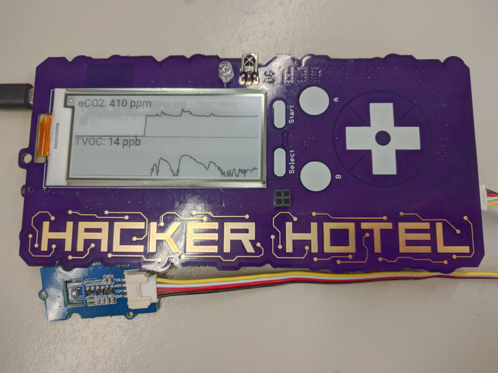

HackerHotel2019 TVOC Grapher
============================
An app for the HackerHotel2019 badge that displays readings from the SGP30
volatile organic compound sensor.

It shows the current value and a graph for two measurements:

* The Total Volatile Organic Compound count in parts per billion
* The equivalent CO2 count in parts per million

## Media

